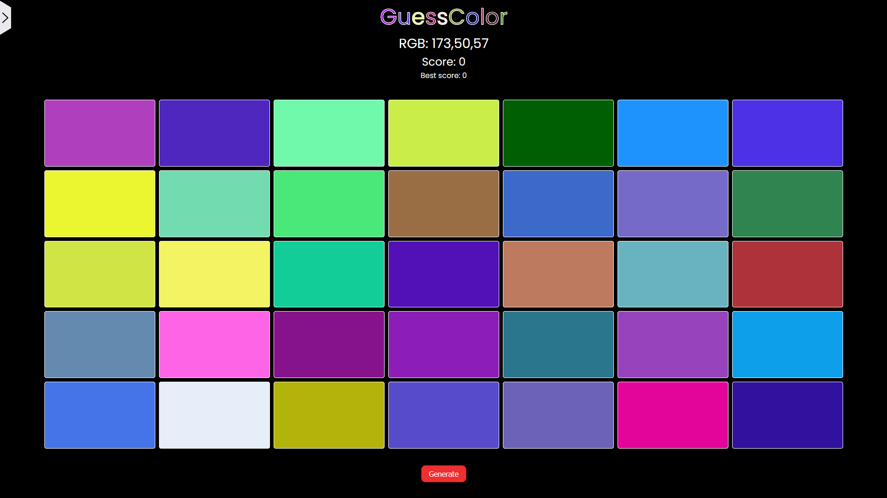

# Guess the Color Game

## How does the game work?

Guess Color is a web-based game where players have to guess the correct color based on various color representations like RGB or HEX values. It offers different difficulty levels and customization options for an enhanced gaming experience.

You can play game here: https://turbina4.github.io

